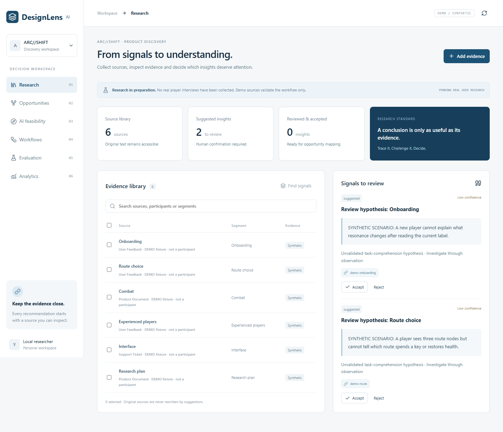

# DesignLens AI

[](https://github.com/QiQiyzhu/designlens-ai/actions/workflows/backend.yml) · [A–T interview dossier](docs/interview-dossier.md) · [Actual Linux CI](https://github.com/QiQiyzhu/designlens-ai/actions/runs/34470378441)

**Evidence-driven product discovery: carry a decision from its original evidence through an opportunity, architecture choice, workflow, evaluation and experiment.**

An AI product management portfolio MVP. Its purpose is to make product reasoning inspectable, including the decision **not to use AI**.

**Decision walkthrough:** [When evidence is insufficient, stop the decision](docs/decision-case-study.md) · [30-second / 3-minute / 8-minute interview route](docs/interview-deep-dive.md) · [48 historical cases, fresh deterministic replays and actual rejection paths](reports/decision-case.json). A valid quote can still be irrelevant; research and human outcome claims remain pending.

**DeepSeek integration:** [Server configuration and bounded real-model probe](docs/real-model-setup.md). `deepseek-flash` uses JSON output, explicit non-thinking mode, observed usage and fail-closed error receipts. The default probe makes zero calls; `--execute --max-calls 1..3` explicitly enables a small synthetic test. [Actual first probe](docs/real-model-results.md): **3 real responses, 2/3 development-contract passes**, with the over-abstention failure preserved; 874 observed total tokens. Real participants and validated product decisions remain zero.

## 1. Product one-liner
Turn scattered evidence into a reviewable decision packet, with source links, explicit human judgments and reproducible technical checks. [One-pager](docs/product/01_problem-statement.md)

## 2. User problem
The hypothesis: a PM can produce a summary quickly but may lose the chain connecting a user observation, a priority choice and the test that justifies a feature. This need is **not yet validated with target users**. [Target users](docs/product/02_target-users.md)

## 3. Research evidence
**PENDING REAL USER RESEARCH. No real player dataset has been provided.** Competitor research uses official public sources checked 2026-09-10. The application contains clearly labeled **DEMO/SYNTHETIC scenarios**, not interviews. An 8–12 person ARC//SHIFT qualitative pilot, consent text, observation sheet and survey are ready for real recruitment. [Research plan](docs/research/arc-shift-plan.md) · [Competitor analysis](docs/product/05_competitor-analysis.md)

## 4. Product demo
Run the local prototype, then: open a synthetic source → review its exact quote → accept an observation with a note → create and decide an opportunity → compare No AI/Rules/RAG → run a versioned workflow → approve/reject the candidate → inspect actual evaluation failures → draft an experiment. No API key is needed for the deterministic extractive mode.

Six React/TypeScript product areas connect to FastAPI and SQLite. The interface is a prototype, not a substitute for manually building the six [Figma frames](docs/figma-screen-specification.md).



## 5. Opportunity map
Business goal → observed problem → opportunity → solution → experiment. RICE, ICE and MoSCoW are planning aids with visible assumptions. A recommendation is stored separately from a human decision; an unreviewed insight cannot silently become a confirmed priority. [Map and scoring contract](docs/product/06-opportunity-map.md)

## 6. Why AI / why not AI
The canvas compares No AI, Rules, Search, Traditional ML, LLM, RAG, Agent and Multimodal. It can recommend a label change or rules. Accuracy, latency and costs are unmeasured until actually benchmarked. The proposed game build advisor is **not selected or implemented**; that choice must follow player research. [Feasibility](docs/product/07-ai-feasibility.md)

## 7. Workflow
Input → local retrieval → condition → prompt → extractive/model provider → human approval → schema/provenance validation. Prompt and workflow versions are immutable; diffs and rollback are real. Runs persist input/output, versions, retrieved context, tool calls, elapsed time and errors. Default execution uses deterministic extraction, **not a mocked LLM response presented as inference**. The DeepSeek provider enables real calls through a server-only key; usage is recorded only when returned, and failed requests never fall back silently to the extractor. Arbitrary MCP and autonomous Agent execution are intentionally unavailable. [API](docs/api-contract.md) · [Architecture and boundaries](docs/architecture.md)

## 8. Evaluation results
[Executed evaluation report](reports/evaluation.md) compares the plain-text contract baseline, structured extract contract, retrieval and workflow on 12 synthetic development cases. Each case executes; failed cases remain in the report. These are fixture-level checks of format, provenance and required behavior, **not evidence of model intelligence, real user benefit or held-out generalization**. Human ratings start null; Agent is skipped with a reason. [Dataset](evals/evidence-cases.json)

## 9. Product metrics
Candidate North Star: **Weekly Validated Product Decisions**, requiring real evidence, observed results and a human outcome decision. It remains zero/pending. Analytics separates demo and real-data activity, uses ordered project funnels and returns null for missing denominators. [Metric tree](docs/product/11-metrics.md) · [SQL](analytics/queries.sql) · [Python analysis](analytics/analyze.py)

## 10. Experiment
The current deliverable is a preregistered **protocol**, not a completed experiment. Compare current UI, a traditional intervention and an AI option only if research warrants it. Small samples are usability pilots; no statistically significant A/B claim. [Experiment plan](docs/product/12-experiment-plan.md)

## 11. What changed
We scoped a bounded decision workflow instead of a generic chatbot. Close competitors already provide evidence-linked synthesis, so the differentiation hypothesis is maintaining the feasibility/evaluation/experiment handoff. Exact-extract defaults, explicit human gates and synthetic labels reduce the chance that fluent output or demo metrics become unsupported product claims. [Decision log](docs/decision-log.md) · [Case study](docs/case-study.md)

## 12. What I would do next
Recruit real PM/player sessions, identify the top three observed problems, compare non-AI alternatives, select one MVP, then conduct a small usability pilot. Add hosted team infrastructure only after demand and privacy requirements are understood. [Roadmap](docs/product/09-roadmap.md) · [Retrospective](docs/product/13-retrospective.md) · [Interview guide](docs/product-interview-guide.md) · [Résumé claim boundaries](docs/resume-claims.md)

## Run locally
Python 3.11+ and **Node 22.13+** are recommended (Vite 8 requires a compatible recent Node runtime). This release was checked with Python 3.11.0 and Node 24.16.0 on Windows. From the repository root:

```powershell
python -m venv .venv
.\.venv\Scripts\python.exe -m pip install -r backend/requirements-lock.txt
.\.venv\Scripts\python.exe -m uvicorn backend.app:app --host 127.0.0.1 --port 8001
```

In another terminal:

```powershell
cd frontend
npm ci
npm run dev
```

The frontend proxies `/api` to port 8001. On macOS/Linux use `.venv/bin/python`. After `npm run build` in frontend, restarting FastAPI serves the built UI from the same origin. SQLite is created in ignored `data/`. Do not put raw research in Git. This is a single-user local prototype without authentication; it is not ready for unprotected real-data hosting.

```powershell
.\.venv\Scripts\python.exe -m pytest -q
.\.venv\Scripts\python.exe -m scripts.evaluate --output reports/evaluation.json
.\.venv\Scripts\python.exe -m analytics.analyze --db data/designlens.sqlite3 --demo --output reports/analytics-demo.json
```

After building and starting FastAPI, open `http://127.0.0.1:8001/` for the complete same-origin demo. The [baseline validation report](docs/validation-report.md) records 43 backend tests, 6 browser user flows, 48 synthetic evaluation executions and the built-app smoke check. The decision-case extension added one stale-evidence protocol regression. The DeepSeek transport/probe extension adds 19 contract and failure checks: **63 local backend tests passed**, with [fresh JUnit evidence](reports/remote-provider-tests.xml); [current evidence and CI status](docs/decision-case-study.md#本轮验证记录). From frontend, `npm test` runs browser checks against an isolated database; `node scripts/smoke.mjs` checks the built local app.

Provider environment settings and exact PowerShell commands are documented in [DeepSeek setup](docs/real-model-setup.md) and [.env.example](.env.example). No keys are committed. Paid inference is opt-in. The [separate DeepSeek receipt](reports/deepseek-smoke.json) contains three real calls; the default 48-case report remains deterministic extraction.

## Portfolio deliverables
| Requested artifact | Location |
|---|---|
| A One-pager / B Research | [One-pager](docs/product/01_problem-statement.md), [research pack](docs/research/arc-shift-plan.md) |
| C Competitive / D Opportunities | [Official-source analysis](docs/product/05_competitor-analysis.md), [opportunity map](docs/product/06-opportunity-map.md) |
| E PRD / F Figma | [PRD](docs/product/10-prd.md), [screen specification](docs/figma-screen-specification.md) |
| G Feasibility / H Workflow | [Canvas](docs/product/07-ai-feasibility.md), [contract](docs/api-contract.md) |
| I Evaluation / J Analysis | [Actual run report](reports/evaluation.md), [SQL/Python](analytics/) |
| K Experiment / L Roadmap | [Protocol](docs/product/12-experiment-plan.md), [roadmap](docs/product/09-roadmap.md) |
| M Retrospective / N Interview | [Retrospective](docs/product/13-retrospective.md), [30 questions](docs/product-interview-guide.md) |

AI-assisted implementation and documentation are disclosed. The author must understand, review and explain the work; generated artifacts are not evidence of having led a real team, interviewed users or improved business metrics.
