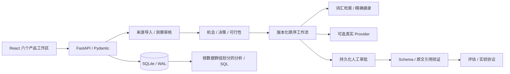

# DesignLens AI · A–T 面试讲解手册

核验日期：2026-09-10。仓库：[QiQiyzhu/designlens-ai](https://github.com/QiQiyzhu/designlens-ai)。本机完整演示：http://127.0.0.1:8001/ 。本项目由 AI 辅助实现，定位是可运行的产品发现与实验设计工具。真实用户访谈尚未开始；默认执行器是确定性证据摘录，不应描述成训练过的模型或生产 SaaS。

**90 秒讲法：** 我想解决产品决策中“结论找不到原始依据”的问题。DesignLens 把来源、人工审核的观察、机会、架构选择、工作流验证和实验协议串起来。用户可以明确选择 No AI，也可以比较规则、检索和模型方案。我实现了可追溯引用、版本快照、持久化人工审批和区分演示/真实数据的分析。当前实际通过 63 项后端测试、6 项浏览器流程，并执行了 48 次合成夹具检查。它证明流程约束可执行；另完成三次真实 DeepSeek 调用，其中两例满足开发契约，一例过度弃答保留为失败；真实需求、用户价值和模型泛化仍待研究。

## A. 最终系统架构



前端负责交互与可视化；后端决定哪些洞察可被引用、机会能否确认、实验是否有已确认的依据。运行时固定工作流、提示词和来源快照，避免执行一半时悄悄读到新版配置。单体和 SQLite 符合当前单人研究工具规模，没有引入缺乏需求的分布式系统。

## B. Repository Tree

```text
DesignLensAI/
├── backend/
│   ├── app.py             API 与产品决策约束
│   ├── models.py          输入边界
│   ├── db.py              SQLite 与事件记录
│   ├── importer.py        TXT/MD/CSV/JSON 来源导入
│   ├── engine.py          检索、摘录、工作流、审批
│   ├── remote_provider.py DeepSeek 传输、预算、错误回执
│   ├── feasibility.py     8 类实现方案的规划规则
│   ├── evaluation.py      实际执行开发夹具
│   ├── analytics.py       群组与漏斗
│   └── seed.py            明确标注的演示来源
├── frontend/src/          六个 React 工作区
├── frontend/e2e/          真实后端浏览器验收
├── tests/                后端行为测试
├── evals/                12 个合成开发案例
├── analytics/            SQL 与可执行分析
├── scripts/              评估 / HTTP 采样
├── reports/              原始结果与失败案例
├── docs/product/         13 份产品设计文档
├── docs/research/        招募、同意、观察与问卷方案
└── .github/workflows/    Linux CI
```

## C. Database Schema

以下是 [db.py](../backend/db.py) 实际创建的六张表，不是理想化 ER 图。

| 表 | 主键及字段 | 用途 / 索引 |
|---|---|---|
| users | id PK, name, is_demo | 当前本地所有者 |
| projects | id PK, name, created_at, is_demo | 本地研究项目 |
| entities | id PK, kind, data JSON text | 来源、洞察、机会、版本注册表等；entities_kind(kind) |
| events | id PK, user_id, project_id, name, entity_id, timestamp, is_demo, properties JSON | events_cohort(is_demo,timestamp,name,project_id) |
| workflow_runs | id PK, workflow_id, user_id, project_id, status, created_at, latency_ms, is_demo, data JSON | 保存运行快照、审批状态、trace |
| experiments | id PK, opportunity_id, status, created_at, is_demo, data JSON | 实验协议 |

关系主要由 API 校验，**没有数据库外键约束、完整规范化实体或多租户隔离**。WAL 改善本地读写并存；每个 Store 方法有提交/回滚。`save_experiment` 写 experiments 与 entities 是两次事务，存在中间失败风险；真实团队版应迁移到数据库约束和单事务服务层。JSON 方便迭代，代价是查询和迁移约束较弱。

## D. RAG Pipeline

导入与同意确认 → 原文/来源 ID/演示标记 → 英文词项与中文单字分词 → 交集数量排序 → 截取 Top-K 来源 → 最多 20 条、每条最多 320 字符的精确摘录 → JSON Schema → 引用 ID、原文包含关系及 text=quote 检查 → 人工解释。

实际代码见 [engine.py](../backend/engine.py)。它是可复现的**词汇检索 + 摘录基线**，没有 embedding、向量数据库、重排模型或语义蕴含判断。中文单字匹配和英文词面匹配会遗漏同义表达；原文里出现一句话也不能证明其事实正确。DeepSeek Provider 有真实 HTTP 适配，默认 deepseek-flash；本表的 48 次结果仍来自 extractive。独立 [真实调用配置与证据约定](real-model-setup.md) 将模型探针与合成研究结果分开。

## E. Agent Workflow

本项目实现有边界的顺序工作流：Input → Retrieval → Condition → Prompt → Extractive/LLM → Human approval → Validate。节点可以增删、排序、版本化；运行保存 next_node 与快照，等待审批后从正确节点继续。没有自主规划、任意工具选择、反思循环或多 Agent。选择这一边界的原因是研究者需要审阅证据并承担决策，而不是自动扩大行动范围。

洞察“生成”与“接受”分开；只有人工接受的洞察能进入机会依据。机会确认时再次检查审核状态；创建实验协议需要已确认机会，避免先批准、后来证据被驳回却仍继续执行。

## F. MCP 设计

**N/A：当前不提供任意 MCP 执行。** 工作流校验明确拒绝不支持的 MCP 节点；现有 evidence_search 是进程内只读检索。产品研究工具暂时不需要外部写操作。若未来出现真实跨工具需求，应先确定身份、工具权限、参数校验、审计、超时和数据授权，再增加可替换适配层；这些是后续设计，不是当前交付。

## G. LLMOps 设计

提示词和工作流保存不可变版本、active_version、diff；回滚创建新版本，而不是覆盖历史。每次运行保存实际 provider/model、版本、输入输出、检索来源、耗时、错误、人工审核及 trace。token_usage/cost_usd 初始为 null；没有调用模型就不填“0 元推理成功率”。DeepSeek 另存请求/响应 SHA256、响应模型、状态码、可用请求 ID、token 用量和错误耗时；账单未核对时 cost_usd 仍为 null。开发评估的案例、变体和结果落盘，可查看失败详情。

这具备本地版本管理和执行可追溯性；没有生产灰度发布、模型漂移检测、在线 SLO、计费核对或完整多模型质量对比。

## H. Reliability 机制

输入 Pydantic 严格校验；导入先完整验证后持久化；SQLite 单方法事务失败回滚；运行保存固定配置；审批有明确状态；无证据时 abstain；模型连接超时 5 秒、其余 HTTP 操作默认超时 30 秒（不是整段执行硬截止），请求/响应大小受限；外部调用失败保留错误，不偷偷改成假成功。引用错误不能成为合格输出。前端保留失败表单内容并显示可操作错误。

仍需补事务级工作流并发控制、失败后恢复矩阵、备份恢复演练及长时间压力测试。当前没有分布式任务队列，不声称 exactly-once 执行。

## I. Security 机制

导入内容被当作数据，不运行文件里的命令、公式或脚本；导入限制 1 MB UTF-8 / 500 记录。真实研究导入要求确认同意与脱敏。SQL 使用参数绑定。密钥来自后端环境变量，不进入前端或 Git。输出采用结构化引用校验，演示数据和真实数据分组统计。

当前没有登录、RBAC、租户隔离、加密数据库或正式删除/留存治理。请用合成数据做本地面试演示；发布团队版前，身份与数据治理是实质性工程工作。精确引用只能约束输出形式，不能代替模型注入防御评测。

## J. Test 数量与实际结果

| 层级 | 实际结果 | 证据 |
|---|---|---|
| 后端 | 63 passed；44 原有检查 + 19 远程适配/探针检查，零付费模型请求 | [本轮 JUnit](../reports/remote-provider-tests.xml) |
| 浏览器 | 6 passed，真实 FastAPI/SQLite | [本轮报告](../reports/remote-provider-browser-tests.json) |
| 真实 DeepSeek 小探针 | 3 次响应，2/3 任务契约通过，874 token；非 benchmark | [逐例回执](../reports/deepseek-smoke.json) |
| 开发夹具 | 12 × 4 = 48 次实际执行 | [原始 JSON](../reports/evaluation.json) |
| 前端 | TypeScript、lint、production build 通过 | [验证记录](validation-report.md) |
| 依赖 | npm audit 0 项已知漏洞，当次快照 | [审计](../reports/npm-audit.json) |
| Linux CI | 适配代码提交 8d7e26b 的 backend + browser 成功 | [Run 34470378441](https://github.com/QiQiyzhu/designlens-ai/actions/runs/34470378441) |

浏览器六个 case 内覆盖完整业务步骤，不是六个点击断言。流程包括引用回看、CSV 导入与错误恢复、人工审核、机会与实验门控、提示词/工作流版本、持久化审批、失败案例和 390px 布局。自动测试中的“审核人操作”不算真实用户研究。

## K. RAG Benchmark 真实结果

| 实际变体 | 通过数 | 格式 / 引用通过率 | 平均执行耗时 |
|---|---:|---|---:|
| Prompt V1 文本契约基线 | 0/12 | 0% / 0% | 0.011 ms |
| Prompt V2 结构化摘录 | 11/12 | 100% / 100% | 0.007 ms |
| Retrieval + 摘录 | 12/12 | 100% / 100% | 0.089 ms |
| Workflow | 12/12 | 100% / 100% | 0.094 ms |

数值来自 [evaluation.md](../reports/evaluation.md)，数据 SHA256 为 `71ecece501189fd39ec5cb244485247231a5bb06115d31171452bf0bc72131dc`。Workflow 有 10 个待人工审批结果，这不等于已批准。全部是同一套合成开发数据上的确定性执行，human ratings 为 null。**没有独立检索 Recall@K/MRR/nDCG 实验，也没有真实 LLM 的 RAG benchmark。** 因此不能把表里的 0→100% 写成提示工程带来的模型提升。另有 [三次真实 DeepSeek 直接来源调用](real-model-results.md)，两例通过、一例过度弃答失败；它没有使用相同四变体处理链，不属于此表的 RAG benchmark。

## L. Agent Ablation 真实结果

**N/A：没有自主 Agent。** 评估中 Agent 被明确 skipped。四种实际变体测试输出契约、检索和审批接线；它们不是多 Agent 消融，也不能据此比较智能体解题能力、token 节省或 ROI。产品上排除缺乏必要性的 Agent 本身是可解释的架构选择。

## M. Performance 真实结果

2026-09-10，在 Windows / Python 3.11、已有合成演示数据库上，对真实 `GET /api/bootstrap` 进行 10/25/50 个工作线程的只读 HTTP 采样。每组请求数为工作线程数的三倍，有一次预热；其他项目任务同时运行。

| 并发线程 | 请求数 | P50 | P95 | P99 | 错误率 |
|---|---:|---:|---:|---:|---:|
| 10 | 30 | 37.916 ms | 146.356 ms | 155.679 ms | 0/30 |
| 25 | 75 | 122.204 ms | 370.281 ms | 391.106 ms | 0/75 |
| 50 | 150 | 163.908 ms | 456.932 ms | 743.073 ms | 0/150 |

[原始逐请求结果](../reports/performance-readonly.json) · [复现脚本](../scripts/benchmark_readonly.py)。HTTP 时间包含数据库读取、序列化和本机调度；这组采样没有单独 DB latency、LLM latency、长时间稳态或跨机器结果。P50 为中位数，P95/P99 为排序后的下界样本位点。这是 255 个短时只读请求的观测，不代表生产容量或复杂工作流吞吐。另有三次真实 DeepSeek 观测：684.770 / 343.148 / 853.852 ms，合计输入 795、输出 79 token；样本太少，未声称生产延迟分位数，账单未知仍为 null。

## N. 失败案例

1. 文本基线缺少结构化契约，12/12 格式失败；失败保留在报告里，不能删掉后只报成功变体。
2. 结构化摘录的一个案例未满足所需证据行为：格式正确不代表找到正确上下文。
3. 早期提示词与工作流 UI 读取活动配置，可能与保存版本不一致；修复为版本绑定与运行快照。
4. 已关联机会的洞察后来被驳回：确认机会和创建实验时必须重新检查，不能只验证首次创建。
5. 缺少指标分母时原本易展示误导的 0%；改为 null 和空状态。
6. CSV/JSON 导入失败不应丢失输入；界面保留内容及错误。
7. 真实 DeepSeek 对 instruction-data 弃答，违反既有“保留敌意材料为引文”的覆盖契约；格式与禁止内容检查通过，整体任务失败。没有泄密观察，也不能由一次弃答证明注入防护完备。[原始结果](real-model-results.md)

这些修复的验证范围见 [validation-report.md](validation-report.md)。真实用户对流程是否理解、是否愿意使用仍未知。

## O. 尚未完成的问题

| 待完成 | 验收方式 |
|---|---|
| 真实 PM/玩家研究与需求优先级 | 按同意流程招募，保留脱敏来源与观察，人工编码 |
| 手动 Figma 设计实践 | 根据六个页面规格自行搭建组件、约束与交互 |
| 真实模型/检索质量 | 已有三次真实调用；仍需独立测试集、人工标注、稳定模型版本、账单与更充分样本 |
| 真实产品实验 | 预注册干预、指标和样本方法；结果出来后再作结论 |
| 团队与托管能力 | auth、权限、数据库约束、迁移、备份、恢复、审计 |
| 事务和并发完善 | 实验双写一致性、并发审批和多进程竞争测试 |

## P. 10 个必须逐行读懂的 Backend 文件

| 文件 | 阅读时必须解释 |
|---|---|
| [backend/app.py](../backend/app.py) | API 中业务门控为什么不能放在前端 |
| [backend/models.py](../backend/models.py) | 输入枚举、长度和 effort>0 如何防止非法状态 |
| [backend/db.py](../backend/db.py) | 参数绑定、WAL、提交/回滚及双写缺口 |
| [backend/importer.py](../backend/importer.py) | 同意、编码字节限制、解析与来源哈希 |
| [backend/engine.py](../backend/engine.py) | 词汇排序、严格摘录、快照、审批恢复 |
| [backend/feasibility.py](../backend/feasibility.py) | 规则建议的边界、No AI 和隐私/延迟约束 |
| [backend/evaluation.py](../backend/evaluation.py) | 什么算通过，哪些结果是 pending/skipped |
| [backend/analytics.py](../backend/analytics.py) | 群组、顺序漏斗、空分母 |
| [backend/seed.py](../backend/seed.py) | 为什么演示标签必须贯穿来源和派生结果 |
| [backend/remote_provider.py](../backend/remote_provider.py) | DeepSeek 思考开关、请求边界、失败保留与真实用量 |

## Q. 5 个必须读懂的 Frontend 文件

| 文件 | 阅读重点 |
|---|---|
| [App.tsx](../frontend/src/App.tsx) | 工作区状态、来源导入、错误处理与焦点管理 |
| [WorkspacePanels.tsx](../frontend/src/WorkspacePanels.tsx) | 机会、可行性、版本、审批、评估与分析的交互 |
| [api.ts](../frontend/src/api.ts) | 真实接口请求、响应与错误传播 |
| [main.tsx](../frontend/src/main.tsx) | React 挂载和 StrictMode |
| [style.css](../frontend/src/style.css) | 信息层级、窄屏、弹窗与滚动边界 |

两个主组件文件仍偏长；面试时应说明未来按独立业务区域拆分，不能说已经实现复杂前端领域架构。

## R. 10 段必须能够手写或口述的关键代码

以下是现有代码的核心表达式或等价教学缩写；完整异常分支以链接源文件为准。

1. **真实来源门控**（importer.py）：`if not request.is_demo and not request.consent_confirmed: raise ValueError(...)`。客户端勾选不能成为系统具有完整合规能力的证明。
2. **安全读取**（db.py）：`db.execute("SELECT data FROM entities WHERE id=? AND kind=?", (entity_id, kind))`。不能把用户输入插入 SQL 字符串。
3. **事务释放**（db.py）：`try: yield db; db.commit()` / `except: db.rollback(); raise` / `finally: db.close()`。解释提交异常、回滚和关闭的顺序。
4. **稳定检索排序**（engine.py）：`ranked.sort(key=lambda x: (-x[0], x[1]))`。第一项是词项交集数，第二项保留同分来源顺序。
5. **引用约束**（engine.py）：依次验证 `evidence_id in index`、`quote in source["content"]`、`text == quote`。这只验证出处，不验证事实与语义蕴含。
6. **运行快照**（engine.py）：`{"workflow": copy.deepcopy(workflow), "prompt": copy.deepcopy(prompt), "sources": copy.deepcopy(sources)}`。解释浅拷贝为何可能被后续修改污染。
7. **版本回滚**（app.py）：读取旧版本内容 → 写入递增的新版本 → 更新 active_version → 保存 diff。口述为何不能直接覆盖旧行。
8. **人工审批恢复**（engine.py）：检查 run 的等待状态 → 保存 approved/note → 按 next_node 执行快照后续节点 → 持久化。解释重复批准和版本变化边界。
9. **RICE 计算**（app.py）：`reach * impact * confidence / effort`，输入保证 effort>0；这些是用户估计值，界面标明假设，不能当观测数据。
10. **空分母**（analytics.py）：`return round(numerator / denominator, 4) if denominator else None`。随后解释漏斗必须按同一项目、同一群组和事件顺序统计。

## S. 20 个面试追问与回答要点

1. **实际需求证据在哪？** 尚无真实用户研究；当前是待验证假设，有研究协议和演示数据，明确不冒充访谈。
2. **与普通总结工具有什么区别？** 侧重来源→人工判断→可行性→验证→实验的决策链；差异价值仍需研究。
3. **为什么允许 No AI？** 产品结果优先，低延迟、隐私、无数据等条件可能更适合规则或界面调整。
4. **为什么没有自主 Agent？** 当前关键步骤依赖人工研究判断，自治写操作没有被真实需求证明。
5. **为什么用 SQLite？** 本地单人、易复现；团队并发、权限和事务规模扩大后要迁移。
6. **JSON 表会带来什么代价？** 约束和查询较弱、迁移更复杂；当前不足明确记录。
7. **引用正确等于结论正确吗？** 不等于；只证明原文包含该摘录，还需人工判断、反例和来源质量。
8. **中文检索怎么做？** 目前单字 token 交集，是可解释基线；同义词、多义词和长文召回都有限。
9. **12/12 能证明什么？** 仅合成开发夹具上的契约行为；不能证明真实模型质量或未知问题泛化。
10. **为什么 V1 是 0/12？** 文本输出故意不符合结构化契约；它显示契约差异，不是差模型。
11. **为什么 token/cost 为空？** 默认 extractor 没有模型调用；远程适配只记录服务商实际返回的 usage，未知账单仍为 null。
12. **工作流运行中修改提示词怎么办？** 使用启动时深拷贝的固定版本；新配置影响新的运行。
13. **审批页面刷新会怎样？** 等待状态和 next_node 已持久化，可重新加载并继续。
14. **洞察被驳回后旧机会怎么办？** 确认与实验创建重新验证依赖，阻止 stale evidence 静默进入下一步。
15. **怎样防止演示 DAU 伪装成真实增长？** is_demo 贯穿来源、运行和事件，查询显式选择群组。
16. **漏斗为什么需要顺序？** 创建实验后补来源不能算正常转化；同项目按时间逐步推进。
17. **P95 的实验条件是什么？** 短时本地只读 HTTP、合成小库、多项目同时运行，不能推导生产吞吐。
18. **第一个真正的实验怎么做？** 先研究定位问题，比较现状与非 AI 干预；只有必要时才加入 AI，先做可用性试点。
19. **最需要补的工程可靠性是什么？** 实验双写事务、并发审批、身份权限和备份恢复，优先于增加新模型。
20. **哪些工作是你本人完成的？** 如实说明 AI 辅助实现范围；本人必须能复现演示、解释代码与取舍，并完成真实研究后再主张研究成果。

## T. 根据真实结果生成的 5 条简历 Bullet 候选

仅在本人读懂、复现并能解释后使用，面试中如实说明 AI 辅助开发。

- 构建 React/FastAPI/SQLite 产品发现原型，将证据来源、人工审核、机会排序、架构评估和实验协议连接为可追溯流程。
- 实现提示词与工作流不可变版本、运行快照和持久化人工审批，通过后端约束阻止未审核或已驳回证据进入确认决策。
- 建立并执行 63 项后端测试、6 项真实后端浏览器流程及 48 次合成开发夹具检查，保留失败、待审批与未运行结果。
- 实现带来源 ID 的精确摘录校验、演示/真实数据群组隔离及顺序漏斗分析，完成实际 Linux CI 验证。
- 接入有输出上限、零重试与失败回执的 DeepSeek 服务端适配；执行 3 次真实合成案例调用，保存 2 例契约通过与 1 例过度弃答失败、874 token 及逐请求延迟，未将调用成功等同用户价值。

不要写“提升留存”“完成真实用户研究”“模型准确率提升到 100%”“生产多租户安全”或“已完成 Figma 设计”。这些都没有当前证据支持。
