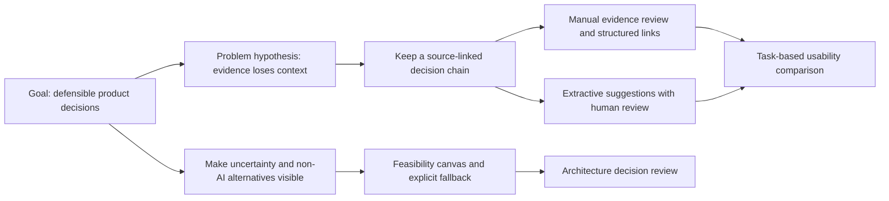

# Opportunity map

**PENDING REAL USER RESEARCH**. The map below contains hypotheses, not player findings.

Each persisted opportunity records problem, segment, frequency basis, severity, potential business impact, evidence IDs/confidence, solution and risks. The app prevents creating an evidence-backed opportunity from unaccepted insights. “AI recommendation” and “human decision” are separate fields. The default recommendation is a deterministic planning suggestion and labeled accordingly.

## Prioritization contract
RICE = reach × impact × confidence / effort. Reach is the owner's estimate in a stated period, not imported interview count; confidence is 0–1; effort is person-weeks > 0. ICE = impact × confidence × ease, with ease = 1 / effort in this MVP (display the convention; do not compare it to a different ICE scale). MoSCoW is a user-selected category. None of these calculations converts weak evidence into certainty.

Before confirming, the owner must explain the decision. A rejected opportunity and its evidence remain inspectable. High evidence confidence requires several independent sources and human assessment of relevance; a large number of duplicate records must not inflate it. Extractive suggestions default to Low pending review.

## Real ARC//SHIFT map
Await raw sessions, then code onboarding, combat, weapon difference, build, resonance, route, progression, difficulty and information hierarchy without assuming all nine are problems. Select the top three using observed task consequences, independent participant evidence and counterexamples. Do not fill a polished map with fabricated quotes while waiting.
