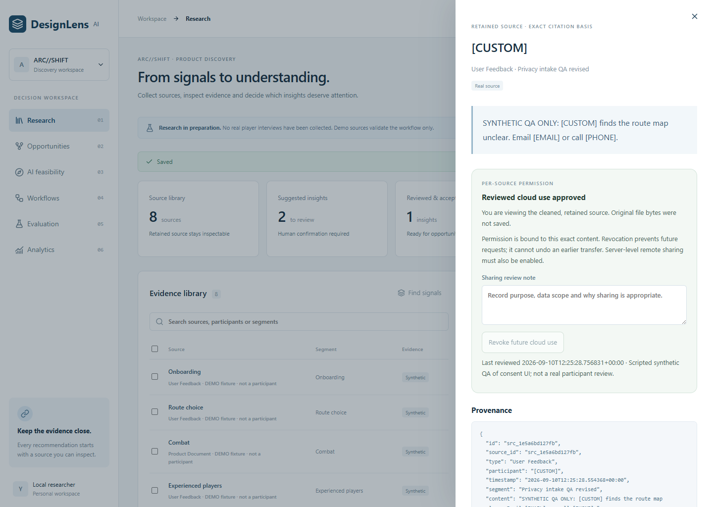

# 从合成演示走向可审查的研究入口

## 外部参照与本轮选择

核对日期：2026-09-10。本轮参考三个一手来源，目的是确定真正缺少的使用步骤，而不是复制厂商规模或把赛事标准当作已获得的资格。

| 一手来源 | 可借鉴的判断 | 本项目实际选择 |
|---|---|---|
| [Dovetail：管理 PII](https://docs.dovetail.com/academy/manage-pii-in-dovetail) 与其 [自动清理更新](https://dovetail.com/changelog/automatic-redaction/) | 材料清理、审查、访问与保留需要落入工作流；自动建议和人工应用可以分开 | 在本机提出替换建议，先预览再确认；不把原始研究材料送给模型做首次清理 |
| [Microsoft HAX：人机交互指南](https://www.microsoft.com/en-us/haxtoolkit/ai-guidelines/) | 交互必须考虑正常使用、系统犯错以及长期反馈 | 清理后仍显示局限，修改输入使旧确认失效，错误可恢复；云端授权可撤销 |
| [Imagine Cup 2026 MVP 官方说明](https://imaginecup.microsoft.com/en-us/competition/17904) | 可演示的产品、客户验证、包容性与实际实现都应可检查 | 增加能由浏览器完整走通的真实研究入口，不增加“已验证需求”数字。该届赛程已结束，且有 Microsoft AI 技术要求；本项目采用 DeepSeek，没有宣称具备该赛事报名资格 |

原有短板是：导入界面只有“已匿名化”的复选框，远程权限主要由全局环境变量决定。现在，真实材料要经过本地清理预览和确认才能持久化；云端使用还需要逐来源授权。身份认证、多租户、保留期限与删除治理仍未实现，不能把这一闭环称为生产合规体系。

## 可演示的闭环

1. **添加材料。** TXT、Markdown、CSV、JSON 都先在本地解析；预览端点不保存来源或研究活动，不调用模型。
2. **清理预览。** 本地规则标记邮箱、电话和部分常见 token；操作者可以添加姓名、地址等逐行替换词。界面呈现将要保留的内容、来源描述和元数据。规则不等于完全匿名化，可能漏掉间接身份或误删数字。
3. **确认后保存。** 确认摘要绑定输入和清理设置；修改内容、参与者、替换词或同意选项会使旧确认失效。真实材料缺少已确认预览会被服务端拒绝。数据库保存清理后的来源和原文件摘要，不保存原文件、替换词列表或原值映射。
4. **逐来源决定云端使用。** 当前来源显示内容摘要、清理审查和本地状态。确认目的与数据授权后，服务端将允许状态绑定到该内容哈希；过期哈希返回 409。环境变量 `DESIGNLENS_ALLOW_REAL_REMOTE=1` 与当前逐来源批准必须同时成立。
5. **撤销与继续审核。** 撤销阻止未来远程请求，不会撤回已经传输的内容。模型生成仍是候选，要通过原文引用校验和既有人审，才能进入机会及实验协议。

真实研究内容不可由 JSON 的 `metadata` 伪造顶层批准状态。批准更新与审计事件在同一个 SQLite 事务中提交。模型调用前也检查渲染输入中的已知标识符；此检查不识别所有姓名、地址或组合身份，不能取代操作者的审查。

截图中的材料明确标记 SYNTHETIC QA，脚本故意使用“真实材料”导入路径来检验权限边界；这不是一位参与者的访谈或真实同意记录。

## 真实模型的下一次检验

旧 [三次 DeepSeek 结果](real-model-results.md) 保持原样，包括敌意来源过度弃答这一旧契约失败。本轮新建 [组件消融协议](research-ablation-protocol.md)：分别观察直接合成输入、本地清理、本地清理加词汇上下文门槛，测量来源保留、信息外发、输出泄漏与过度清理。

新协议明确区分“敌意文本本身不是玩家观察”与“合法观察旁边出现敌意指令”；前者允许弃答，后者仍需要保留相关证据。它是一套新的事先标准，不会把旧 2/3 追溯改写为 3/3。

## 本轮验证与实质性限制

本地后端 76 项通过，包括 10 项导入/授权边界及 3 项批测预算检查；浏览器 7 条完整流程通过，包含预览失效、390px 操作、批准与撤销；TypeScript、lint、构建通过。原有测试和历史模型回执继续保留，更新后的原始测试证据在 [JUnit](../reports/research-intake-tests.xml) 与 [浏览器报告](../reports/research-intake-browser.json)。实际远程消融结果尚待独立运行。

仍是单人本地工具，没有登录和正式的数据保留治理。原文件摘要只能用于与操作者保留的原件对照，不能恢复被删除内容，也不能证明来源在现实世界中真实。人工复核是该工具的使用步骤；未经真实招募、观察与结果评估，真实参与者和有效产品决策仍为 0。
